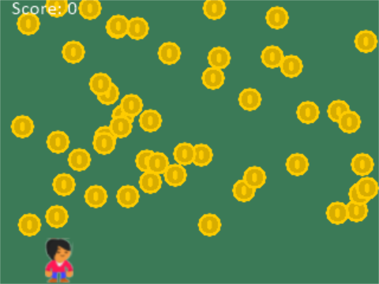

Python Arcade Game Template For GameShell
=========================================

These are instructions on how to get a Python game using the Arcade_ library
working with the GameShell_.

Quick overview:

* Install Python 3.6
* Install the Arcade library
* Clone the game from GitHub
* Install link to menu
* Restart

Install Python 3.6
------------------

GameShell runs on Debian Linux. Right now, Debian uses Python 3.5, and Arcade
requires 3.6. So to install 3.6, we need to tell Debian to look at the "testing"
set of files.

Shell over to your GameShell, and copy/paste the following:

.. code-block:: bash

    echo "deb http://ftp.fr.debian.org/debian testing main" | sudo tee -a /etc/apt/sources.list
    echo 'APT::Default-Release "stable";' | sudo tee -a /etc/apt/apt.conf.d/00local
    sudo apt-get update
    sudo apt-get -t testing install -y python3.6

Install Arcade
--------------

Now that we have Python 3.6, we need to install the Arcade library. Do that with:

.. code-block:: bash

    python3.6 -m pip install arcade

Clone Game
----------

Now clone/grab the code from GitHub:

.. code-block:: bash

    cd ~/games
    git clone https://github.com/pvcraven/gameshell_template.git

Install the Game
----------------

Now we have the code installed, but there is not a link to it from the menu.
Run this command to copy over the link:

.. code-block:: bash

    cd ~/games/gameshell_tempate
    chmod u+x install.sh
    ./install.sh

Reboot
------

We installed the link. We need to reboot the device to re-look at the links.

.. code-block:: bash

    sudo reboot

Update The Code
---------------

Something new on GitHub you want to pull down?

You can update the code with:

.. code-block:: bash

    cd ~/games/gameshell_tempate
    git pull

.. _GameShell: https://www.clockworkpi.com/
.. _Arcade: http://arcade.academy/
